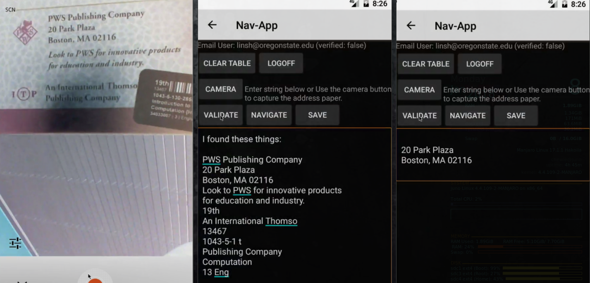

# Nav app
this is actually an android app that can pull address using the camera and uses
google map to help you navigate.
It is specifically used for helping people retrieve text from
paper using the phone’s camera
and cloud services to extract and parse the address instead of manually enter
the address. The app also has
a REST API backend to help store and retrive data by the authorized user. OAuth
is supported by Firebase using email and password.

# Components
##Firebase Authentication
Firebase provided the authentication service and manages user accounts. Only
the email/password is implemented in the app. The backend server verify with
Firebase that the token is valid and process the request.

##Google Cloud Vision API
Specifically the Text Detection is used to extract text from photo taken by the
camera.
	POST https://vision.googleapis.com/v1/images:annotate?key=YOUR_API_KEY

##SmartyStreets API
The standardized address is not a regular language or context-free, I used the API
from SmartyStreets for parsing the text return by the Text Detection.
	POST https://us-extract.api.smartystreets.com\?auth-id=123\&auth-token=abc

##Backend REST APIs
the backend server for this app uses several RESTful APIs to store and retrieve
data such as GET, PATCH, DELETE for each address and GET, POST, DELETE for the
entire address book.

